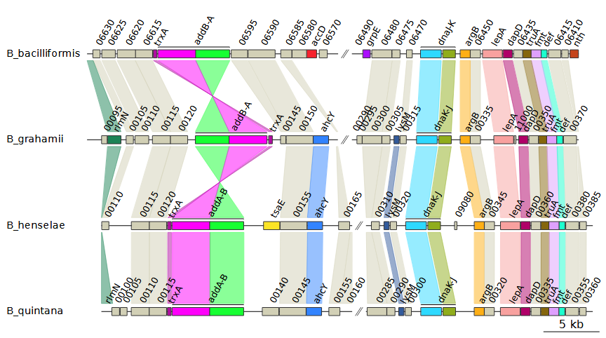

```{r, include = FALSE}
knitr::opts_chunk$set(
  collapse = TRUE,
  comment = "#>"
)
```

# run_genoPlotR.R

The R script `run_genoPlotR.R` is a wrapper script that can generate
gene maps from a single command. `run_genoPlotR.R` was created so that
the majority of features from genoPlotR are accessible directly from a
command-line interface. As such, there are many customization options
available.

At minimum, R and the genoPlotR package must be installed to run
`run_genoPlotR.R`. Some of the features of `run_genoPlotR.R` require the
command-line versions of BLAST or DIAMOND to be installed as well.

## Basic usage

The most prominent use-case of `run_genoPlotR.R` is to create regional
plots of multiple genomes at a time. This usually involves parsing a set
of GenBank files and then using BLAST to create comparisons between the
resulting DNA segments.

An example of such a command is shown below:

```         
Rscript run_genoPlotR.R \
--seg_files "path/to/dataset/GenBank/*" \
--comp_path "path/to/dataset/output/comps" \
--comp_format blastp \
--ids "path/to/dataset/ids.tab" \
--out "path/to/dataset/output/genemap.pdf"
```

The GenBank files are provided by the `--seg_files` option, which
supports the usage of wildcards (`*`) to select multiple files at once.
In this case, all files in the `GenBank` folder will be selected.

The folder specified by `--comp_path` holds the files used to create
comparisons between the DNA segments. The `--comp_format` option tells
`run_genoPlotR.R` which format to use for the comparisons. If DIAMOND or
a BLAST program is selected, like `blastp` here, `run_genoPlotR.R` will
run that program to generate the necessary files, unless the files
already exist in the provided location.

The `--ids` option is often **essential** when you want to make a
regional plot. It specifies the **IDs file**, which can be used to
select which features to plot. The **IDs file** is a table of IDs that
correspond to features to plot in the form of a tab-delimited file.
Below is an example of the contents of an **IDs file**:

| id            | seg_label | fill    | region_plot |
|---------------|-----------|---------|-------------|
| coaE          | Bhenselae | red     | true        |
| coaE          | Bquintana | blue    | true        |
| dnaQ          |           | green   |             |
| AYT27_RS00030 |           | #CA5050 | true        |

The `fill` column changes the color of the selected features, while
adding the value `true` to the `region_plot` column marks the feature to
be plotted. In principle, any column can be included in an **IDs file**.
These columns and the respective values will be added to the `dna_segs`,
overwriting existing data if those columns were already present.

However, The `id` and `seg_label` columns both have special meanings and
are treated differently:

-   `id` is the only mandatory column. It will match the values found in
    this column with those from the `dna_segs`, by default it will look
    in the `name` and `locus_id` columns (this can be changed with the
    `--id_tags` option). The IDs do not have to match exactly.
    Internally, `grep()` is used, so wildcards (`*`) and regular
    expressions will work as well.
-   The `seg_label` column allows you to specify a single DNA segment by
    name. By doing so, you can edit features in only a single `dna_seg`,
    even when the ID in question can be found in multiple `dna_segs`. If
    a row is left empty, or this column is omitted entirely, then all
    `dna_segs` will be queried for each ID.

## Options

### DNA segments

**`-s ["FILE PATH1,FILE PATH2"], --seg_files=["FILE PATH1,FILE PATH2"]`**
<ul>
		(Mandatory): Path to the dna_seg files to read in, with
		file names separated by commas. GenBank files are recommended.
		Each file will become a single dna_seg, so genomes
		consisting of multiple contigs or chromosomes should be
		concatenated into a single file.
		Alternatively, a single file with the suffix `.RDS` can be
		provided, which will be read as an R object containing a list
		of dna_segs.
</ul>
**`-i [FILE PATH], --ids=[FILE PATH]`**
<ul>
		A tab-delimited file with IDs corresponding to features
		that should be plotted. The header should at least contain
		an `id` column, but can include other column names to add
		to the dna_seg objects. The IDs can refer to values from
		any dna_seg column, specified by the `--id_tags` option.
		IMPORTANT: If `--comp_format` is a blastp algorithm or
		DIAMOND, then the `region_plot` column will be carried over
		to the next dna_seg object, for any features linked by the
		comparisons.
		Notable columns include:

- id: An identifying feature ID
- seg_label: The name of the dna_seg object to query
- fill: Anything identifiable as a color by R 
(e.g. `red`, `blue4`, `salmon`, `#88CCEE`)
- region_plot: If the value is `plot`, `true`, `yes`, or `y`, then the genome
neighbourhood of that feature will be plotted.
</ul>
**`-I ["COLUMN1,COLUMN2"], --id_tags=["COLUMN1,COLUMN2"]`**
<ul>
		A list of dna_seg column names to use alongside `--ids`.
		The IDs provided by the `--ids` option will be used as
		queries in the columns provided by this option. Column
		names must be separated by commas.
		(default: `"name, locus_id"`)
</ul>
**`--dna_seg_mode=[DNA_SEG PARSING MODE]`**
<ul>
		How should the dna_seg files supplied by `--seg_files` be
		read? Must be one of: `all`, `ids`, `fast`
- all: Read all dna_seg files provided.
- ids: Read only the dna_seg files mentioned in the `--ids` file, using the 
`seg_label` column.
- fast: Only allowed when making a regional plot using blastp or DIAMOND. 
After reading in a dna_seg, an alignment is made between it and the next
dna_seg, transferring over the `region_plot` column. If there are no features
to be plotted in this next dna_seg, then it is skipped.
</ul>
**`-c [COMPARISON FORMAT], --comp_format=[COMPARISON FORMAT]`**
<ul>
		The format to use for reading in comparison files.
		If the necessary files are not found in `--comp_path`, then
		BLAST or DIAMOND can be chosen here to create them.
		Must be one of: `diamond`, `blast`, `tab`, `orthofinder`,
		`orthomcl, `mmseqs2`, or one of the supported blast
		programs (`blastp`, `blastp-fast`, `blastp-short`,
		`blastn`, `blastn-short`, `megablast`, `dc-megablast`).
		
- diamond: tab-separated DIAMOND result file (`--outfmt 6`)
- blast: tab-separated BLAST result file (`-outfmt 6`)
- tab: a custom tab-delimited file with the following structure:
`"start1 end1 start2 end2 col gene1 gene2"`
- orthofinder: An OrthoFinder format file containing orthogroups for the
provided dna_segs
- orthomcl: A file containing orthogroups in the orthomcl format
- mmseqs2: A file containing clusters of genes in the "Cluster TSV format" 
from mmseqs2, or the cluster output from DIAMOND
</ul>
**`-C [DIRECTORY/FILE PATH], --comp_path=[DIRECTORY/FILE PATH]`**
<ul>
		Path to the directory for the comparison files, or the path
		to a file containing orthogroups, if `--comp_format` is
		`orthofinder` or `orthomcl`. This option is ignored if
		`--comp_format` is not provided. With a `--comp_format` of
		DIAMOND or any BLAST program, this script will attempt to
		create the necessary comparison files if it can not locate
		them in the directory provided. The file names should
		contain the names of the dna_segs joined by an
		underscore, e.g. `"Genome1_Genome2.suffix"`
		default: current directory
</ul>
**`--comp_mode=[COMPARISON MODE]`**
<ul>
		The filter mode used when sequentially parsing the sequence
		alignments for each dna_seg object. This option is ignored
		unless a BLAST program or DIAMOND was chosen using
		`--comp_format`. It is recommended to use `besthit` and
		`bidirectional` only when doing comparisons on a list of
		features, like genes or proteins. Must be one of:
		`besthit`, `bidirectional`, `full`. (default: `full`)
- besthit: Filters the sequence alignment results to include only the best hit
for each query dna_seg
- bidirectional: Filters the sequence alignment results to include only 
bidirectional best hits for each pair of dna_segs
- full: The sequence alignment results are not filtered for best hits
</ul>
**`--diamond_sensitivity=["SENSITIVITY"]`**
<ul>
		The sensitivity option used when running DIAMOND. This
		option is ignored unless DIAMOND was chosen using
		`--comp_format`. Must be one of the following arguments,
		in order of least to most sensitive: `fast`, `default`,
		`mid-sensitive`, `sensitive`, `more-sensitive`,
		`very-sensitive`, `ultra-sensitive`. (default: `default`)
</ul>
**`--update_positions=[AUTO|TRUE|FALSE]`**
<ul>
		Decides whether or not positions of comparison objects
		should be updated to match the positions in the dna_segs.
		Must be one of: `auto`, `true`, `false`. If true, always
		update, if false, never update.
		The default is auto, which updates the positions when
		`--comp_format` is DIAMOND or any of the blastp algorithms.
</ul>
**`--update_region_plot=[AUTO|TRUE|FALSE]`**
<ul>
		Decides whether or not the region_plot column of dna_segs
		should be updated. If `true`, the region_plot attribute
		will be given to each feature that can be linked to a
		feature that already has the region_plot attribute.
		Must be one of: `auto`, `true`, `false`. If true, always
		update, if false, never update.
		The default is auto, which updates region_plot when
		`--comp_format` is DIAMOND or any of the blastp algorithms.
</ul>
**`-o [FILE PATH], --out=[FILE PATH]`**
<ul>
		Name of output PDF file. (default: out.pdf)
</ul>
**`--height=[NUM]`**
<ul>
		PDF height, in inches. (default: auto)
</ul>
**`--width=[NUM]`**
<ul>
		PDF width, in inches. (default: auto)
</ul>
**`-t [FILE PATH], --tree=[FILE PATH]`**
<ul>
		Path to newick format tree file with the dna_seg labels
		(file names) as leaves.
</ul>
**`--annotations`**
<ul>
		Gene annotations from the `gene` column will be plotted.
</ul>
**`-l [COLUMN], --legend_column=[COLUMN]`**
<ul>
		A dna_seg column to use as the basis for plotting a legend.
		Must be the name of a column that appears in all dna_segs or
		`auto`. When `auto`, it will use the `gene` column if it is
		present, and the `name` column if it is not, unless
		`--global_color_scheme` is set to `uniform`, in which case it
		will automatically use the same column as the one used to
		generate the color scheme. A legend will then be plotted
		based on the colors of the dna_seg features, using all of
		the unique values found in the chosen column.
</ul>
**`-g [COLOR SCHEME], --global_color_scheme=[COLOR SCHEME]`**
<ul>
		A color scheme to apply to the dna_segs and/or comparisons.
		Must be one of: `gradient`, `uniform`, `sequential`.
- gradient: Calculates color gradients based on numerical columns. It uses
red hues for direct comparisons, and blue hues for reverse comparisons. It is
applied only to comparisons, and bases the coloring on comparison metrics,
namely `per_id`, `bit_score`, and `e_value` columns, in that order.
- uniform: Generates a color palette based on the possible values a column can
have for all the features that are being displayed. Looks for a column related
to homology, followed by `gene` and `gene_type` if it cannot find any.
Applies itself to both dna_segs and comparisons.
- sequential: Takes alterations made on the colors of features in dna_segs,
and transfers them over to the other dna_segs and comparisons. Only works if
changes have been made to at least 1 dna_seg already. This can be done by 
using `--ids`, for instance.
</ul>
**`-G [DATASET], --color_scheme_dataset=[DATASET]`**
<ul>
		Which dataset to apply the color scheme to. Only applicable
		when `--global_color_scheme` is set to uniform or sequential.
		Must be one of: `auto`, `dna_segs`, `comparisons`.
		The default is auto, which will attempt to automatically
		determine how best to apply the color scheme based on the
		available data.
</ul>
**`-a [NUM], --alpha_dna_segs=[NUM]`**
<ul>
		A number between 0 (transparent) and 1 (opaque) for the
		alpha-transparency level that will be applied to dna_segs.
</ul>
**`-A [NUM], --alpha_comparisons=[NUM]`**
<ul>
		A number between 0 (transparent) and 1 (opaque) for the
		alpha-transparency level that will be applied to
		comparisons.
</ul>
**`--dna_seg_scale`**
<ul>
		A scale will be plotted for each dna_seg.
</ul>
**`-r [NUM], --region_size=[NUM]`**
<ul>
		Neighbourhood size to plot, unless a sequence boundary is
		found first, in bp. Setting this argument to 0 will plot
		the entirety of the dna_segs. This argument is ignored when
		xlims are provided via `--xlims_in` or `--xlims_from_file`
		(default: 10000)
</ul>
**`-x ["XLIMS_SEG1,XLIMS_SEG2"], --xlims_in=["XLIMS_SEG1,XLIMS_SEG2"]`**
<ul>
		Predefined positions to plot for each dna_seg (and
		subsegment). If `--xlims_from_file` is given, this option is
		ignored. dna_segs must be separated by commas, in plotting
		order, with subsegments separated by spaces (same format as
		`--print_xlims`). e.g.:

		`"1 10000 155000 154000,500 10500"`
</ul>
**`-X [FILE PATH], --xlims_from_file=[FILE PATH]`**
<ul>
		Path to a tab-separated file with predefined positions to
		plot for each dna_seg (and subsegment) in the same format
		as that of `--xlims_out`. One line per subsegment, in
		plotting order, with both positions and their dna_seg
		label. e.g.:

| x0    | x1    | seg_label |
|-------|-------|-----------|
| 0     | 13000 | dna_seg1  |
| 25000 | 35000 | dna_seg1  |
| 500   | 10500 | dna_seg2  |
| 25901 | 35901 | dna_seg2  |

		Note: If provided, only dna_segs present in this file
		will be plotted.
</ul>
**`-p, --print_xlims`**
<ul>
		Prints out neighbourhood limit positions to the terminal.
</ul>
**`--xlims_out=[FILE PATH]`**
<ul>
		Name of output xlim file, which will contain the
		neighbourhood limits that were used to plot with.
</ul>
**`-f ["OFFSETS1,OFFSETS2"], --offsets_in=["OFFSETS1,OFFSETS2"]`**
<ul>
		A list of predefined offset values for each dna_seg and
		subsegment. If `--offsets_from_file` is given, this option is
		ignored. For each dna_seg 1 value must be provided, or as
		many values as there are subsegments for that dna_seg.
		dna_segs must be separated by commas, in plotting order,
		with subsegments separated by spaces. e.g.:

		`"150 1300,300"`
</ul>
**`-F [FILE PATH], --offsets_from_file=[FILE PATH]`**
<ul>
		Path to a file with predefined offset values for each
		dna_seg and subsegment. One line per dna_seg, in plotting
		order, with subsegments separated by spaces, e.g.:

		`150 1300`
		`300`
</ul>
**`--print_offsets`**
<ul>
		Prints out offset positions to the terminal.
</ul>
**`-S [FILE PATH], --dna_segs_out=[FILE PATH]`**
<ul>
		Name of output dna_segs file. If provided, the dna_segs
		will be saved as an R object just after reading them in,
		before any alterations are made to it. This way, this
		script can be called again using the same arguments, except
		for providing this file to `--seg_files`, which should in
		most cases produce the same result, but without having to
		wait for the dna_seg files to be parsed.
</ul>
**`--workspace_out=[FILE PATH]`**
<ul>
		Name of output file. If provided, all of the arguments that
		are passed to main plot function `plot_gene_map()` are saved
		to this file as well, as an R object that can be loaded in
		R using the `readRDS()` function.
</ul>
**`-n [NUM], --threads=[NUM]`**
<ul>
		Number of threads for parallel processing, used by BLAST
		and DIAMOND. (default: 1)
</ul>
**`-v, --verbose`**
<ul>
		Print out extra information alongside timings, mostly on writing and 
		reading in files
</ul>
**`-h, --help`**
<ul>
		Show this help message and exit.
</ul>

## Examples

### Using BLAST to create comparisons on the fly

For this example, we downloaded the GenBank (full) files of the most
recent versions of the four genomes that were used in the dataset found
in `data("barto")` from NCBI:

-   Bartonella bacilliformis KC583 (NC_008783.1)
-   Bartonella grahamii as4aup (NC_012846.1)
-   Bartonella henselae str. Houston-1 (NC_005956.1)
-   Bartonella quintana str. Toulouse (NC_005955.1)

Let's say we are interested in the `addB` and `argB` genes. `genoPlotR`
will use gene names in the `name` column when those are present in the
GenBank file, so we can use these gene names as IDs for this
`barto_ids.tab` **IDs file**:

| id   | fill | region_plot |
|------|------|-------------|
| addB | red  | true        |
| argB | blue | true        |

Using this file as input, we can create a basic gene map like this:

```         
Rscript run_genoPlotR.R \
--seg_files "vignette_barto/GenBank/*" \
--comp_path "vignette_barto/comps" \
--comp_format blastp \
--ids "vignette_barto/barto_ids.tab" \
--out "vignette_barto/ex1_1.pdf"
--width 9
```

This will use `blastp` to create comparisons and store the resulting
files in `vignette_barto/comps`. If we were to make another gene map
with the same input genomes, we would not need to run BLAST a second
time, even if we were to look at a different region of these genomes.

```{r ex1_1, include=TRUE, echo=FALSE, out.width="95%"}
knitr::include_graphics("ex1_1.png")
```

### Customization

The comparisons are a bit difficult to track and the figure is fairly
bare-bones in general. So, let's run it again, with a few visual customization
options added in:

```         
Rscript run_genoPlotR.R \
--seg_files "vignette_barto/GenBank/*" \
--comp_path "vignette_barto/comps" \
--comp_format blastp \
--ids "vignette_barto/barto_ids.tab" \
--out "vignette_barto/ex1_2.pdf" \
--width 9 \
--annotations \
--alpha_comparisons 0.5 \
--global_color_scheme sequential \
--print_xlims
```

Instead of showing all BLAST results, we can filter them using `--comp_mode`.
This option can filter the BLAST results by taking only the best hit per query
(`besthit`), or only bidirectional best hits (`bidirectional`). Picking
`bidirectional` does double the amount of BLAST results generated, as the best
hits for the BLAST results in 1 direction now have to match those of the other
direction.
Adding `--annotations` will automatically add annotations, displaying gene 
names, or locus tags when these are not available. The `--alpha_comparisons 0.5`
option adds transparency to the comparisons. 
easier to parse visually. The `--global_color_scheme sequential` option
transfers over the colors we added earlier
to the comparisons they are connected to. This results in the following figure:

```{r ex1_2, include=TRUE, echo=FALSE, out.width="95%"}

```

Note that we also added `--print_xlims`. This printed out the `xlims`, the
start and end coordinates for each subsegment and DNA segment.

```
1368895 1389810 1412813 1435966,16890 40019 79755 100670,21410 44542 84165 105080,19042 42171 74542 95457
```

In the examples above, each DNA segment has 2 subsegments, so 4 coordinates
per DNA segment, with DNA segments separated by commas. Because we chose to
print these `xlims`, we can now manipulate them. For example, we can enter
the coordinates in reverse order for *B_bacciliformis*, inverting that entire
DNA segment. To do so, we can use the `--xlims_in` option, which allows us to
manually enter in coordinates in the same format as the output of 
`--print_xlims`:

```         
Rscript run_genoPlotR.R \
--seg_files "vignette_barto/GenBank/*" \
--comp_path "vignette_barto/comps" \
--comp_format blastp \
--ids "vignette_barto/barto_ids.tab" \
--out "vignette_barto/ex1_3.pdf" \
--width 9 \
--annotations \
--alpha_comparisons 0.5 \
--global_color_scheme sequential \
--xlims_in "1435966 1412813 1389810 1368895,16890 40019 79755 100670,21410 44542 84165 105080,19042 42171 74542 95457"
```

```{r ex1_3, include=TRUE, echo=FALSE, out.width="95%"}
knitr::include_graphics("ex1_3.png")
```

Selecting `uniform` for the `--global_color_scheme` option instead of
`sequential` automatically assigns colors based on the data is available.
In this example, it uses the gene names. Hypothetical proteins are given a 
single, separate color instead. This results in the following plot:

```{r ex1_4, include=TRUE, echo=FALSE, out.width="95%"}

```

The `--legend_column` option will generate a legend based on the values found
in a `dna_seg` column of choice. Alternatively, you can set it to `auto`. If
`--global_color_scheme uniform` was used, the legend will automatically be
based on the same column that was used to generate the color scheme. In all
other cases, picking `auto` defaults to the `gene` column, or the `name` column
if the `gene` column is not present. So, by adding `--legend_column auto` to
the previous plot we get this:

```{r ex1_5, include=TRUE, echo=FALSE, out.width="95%"}
knitr::include_graphics("ex1_5.png")
```

### Visualing cluster results

In addition to sequence alignments from BLAST and DIAMOND, `run_genoPlotR.R`
also supports the use of sequence clustering tools to create the comparisons
between DNA segments. Support is included for the output formats used by 
OrthoMCL, Orthofinder, and mmseqs2. This method requires a bit more 
preparation, as the results must be created beforehand. However, it does offer
certain advantages as well.

For example, we can use DIAMOND to cluster the sequences. This requires FASTA
files for each of the input DNA segments. In the previous examples, BLAST was
used to create the comparisons, which also generates the necessary FASTA files.
The `genoPlotR` includes `genbank_to_fasta()` and `dna_seg_to_fasta()` functions
to create FASTA files directly from GenBank files or `dna_seg` objects,
respectively. Assuming the FASTA files have been made, you could use a command
like this to concatenate them all:

```
cat vignette_barto/fasta/*.fa > vignette_barto/concat.fa
```

The resulting file can then be used for DIAMOND:

```
diamond cluster -d "vignette_barto/concat.fa" -o "vignette_barto/clusters.tab"
```

We can now use this as input for `run_genoPlotR.R` by selecting this file with
`--comp_path` and setting `--comp_format` to `mmseqs2`. **IMPORTANT:** Entering 
`--comp_format diamond` would result in using DIAMOND for pairwise sequence
alignments, not clustering. The clustering results from DIAMOND are in the same
format as those produced by mmseqs2, which is why we select that option instead. 
One of the advantages of
using clustering is that the order of the DNA segments can be freely changed,
as the comparisons are no longer created from pairwise sequence alignments.
Another advantage is that all `dna_seg` features that are in the same cluster
are automatically given the same colors when the uniform color scheme is chosen.
In this example, the comparisons made are the same as those from bidirectional
best hits from BLAST, but clustering results are often more reliable.
```
Rscript run_genoPlotR.R \
--seg_files "vignette_barto/GenBank/*" \
--comp_path "vignette_barto/clusters.tab" \
--comp_format mmseqs2 \
--ids "vignette_barto/barto_ids.tab" \
--out "vignette_barto/ex1_5.pdf" \
--width 9 \
--annotations \
--alpha_comparisons 0.5 \
--global_color_scheme uniform \
--xlims_in "1435966 1412813 1389810 1368895,16890 40019 79755 100670,21410 44542 84165 105080,19042 42171 74542 95457"
```

```{r ex1_6, include=TRUE, echo=FALSE, out.width="95%"}
knitr::include_graphics("ex1_6.png")
```


